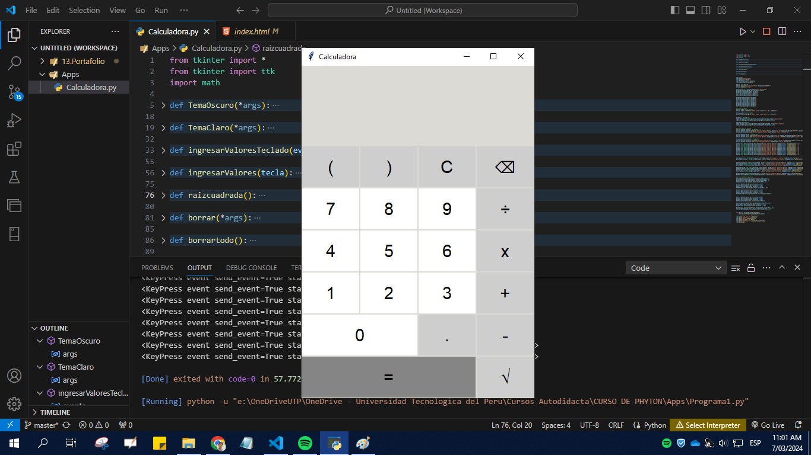
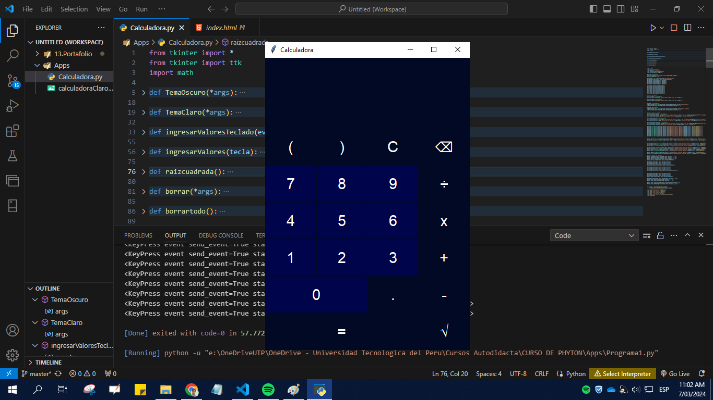

# calculadora_python
En este repositoria realicé una calculadora básica para el ingreso de numeros tanto por la misma aplicación como por teclado. Se utilizo el paquete de Tkinter de Python para la interfaz Gráfica
## Calculadora en tema claro

## Calculadora en tema oscuro

